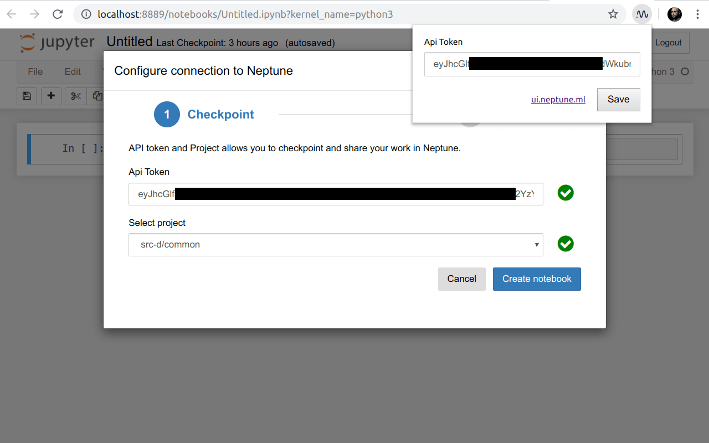

# Neptune API Token Autofiller

Chrome extension for easy Neptune integration configuration.

When you click the "Configure" button of [Neptune.ml](https://neptune.ml) integration with Jupyter notebook, the dialog asks you to provide an API token that identifies your Neptune user. If you often switch between laptops, or your Jupyter often changes the root domain, it may become tedious to copy-paste the token every time. This Chrome extension allows you to memorize the API token, which becomes shared with all your logged-in browser instances. The token is automatically inserted in the corresponding input box of the configuration dialog.

## Installation

Install from the [Chrome Web Store](https://chrome.google.com/webstore/detail/neptune-api-token-autofil/lhiogngfmogmgpkfpmphcgjbpbakopfi).

It is also possible to clone this repo and [Load unpacked](https://stackoverflow.com/a/24577660/69708).

## Usage

Click the Neptune-like extension icon, copy-paste your API token and click "Save". Now, every time you enter the configuration dialog in Jupyter, the token should be automatically inserted. The token should be synced to all your Chrome instances.

The extension does not conflict with the official local storage-based token persistence. If there is a different token assigned, it will not be overwritten.

You don't need the extension if you always use Neptune on a small fixed number of domains such as the default `localhost:8888`.

## License

MIT, see [LICENSE](LICENSE).
